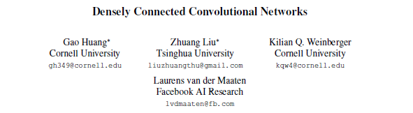
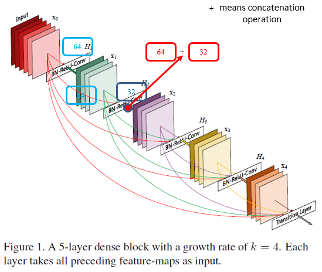
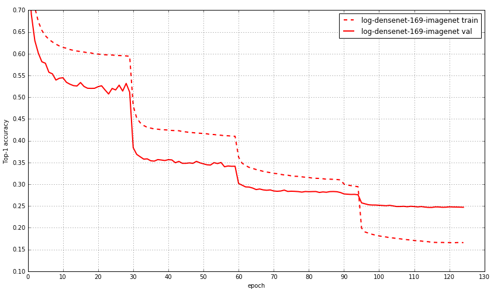

# A MXNet implementation of DenseNet with BC structure

This is a [MXNet](http://mxnet.io/) implementation of DenseNet-BC architecture as described in the paper [Densely Connected Convolutional Networks](https://arxiv.org/pdf/1608.06993v3.pdf) by Gao Huang, Zhuang Liu, Kilian Q. Weinberger, Laurens van der Maaten.

This implementation only focus on imagenet'12 dataset at present. The training procedure is ongoing. So, I hope anyone who are mxnet fun can test this code with me. When I finish, I will update more information about training and validation.

Their official implementation and many other third-party implementations can be found in the [liuzhuang13/DenseNet](https://github.com/liuzhuang13/DenseNet) repo on GitHub.

This is a basic dense block (figure is modified from the [original paper](https://arxiv.org/pdf/1608.06993v3.pdf)). Each layer takes all preceding feature maps as input. It is a very interesting and simple design.

I appreciate [tornadomeet, Wei Wu](https://github.com/tornadomeet). This implementation of DenseNet is adapted from his [Resnet](https://github.com/tornadomeet/ResNet) codes. I also refered other third-part implementations, such as 
two version of PyTorch

1. [Brandon Amos](https://github.com/bamos)
(https://github.com/bamos/densenet.pytorch/blob/master/densenet.py)  
2. [Andreas Veit](https://github.com/andreasveit)
(https://github.com/andreasveit/densenet-pytorch/blob/master/densenet.py)

one version of MXNet (without BC structure and only for cifar10)

3. [Nicatio](https://github.com/Nicatio)
(https://github.com/Nicatio/Densenet/blob/master/mxnet/symbol_densenet.py)

## Requirements

Install MXNet on a mechine with CUDA GPU, and it's better also installed with [cuDNN v5](https://developer.nvidia.com/cudnn).

Please fix the randomness if you want to train your own model and using [Wei Wu](https://github.com/dmlc/mxnet/pull/3001/files) solution.

## Data

ImageNet'12 dataset

Imagenet 1000 class dataset with 1.2 million images. Because this dataset is about 120GB, so you have to download by yourself. Sorry for this inconvenience.

## How to Train

For this part, before you want to train your model, please read the suggestion from [Wei Wu](https://github.com/tornadomeet/ResNet) first. In his page, there is a very detailed information about how to prepare your data. 

When you finised data preparation, please make sure the data locates the same folder of source codes. You also need to change path of path_imgrec in line 92 and line 116 of train_densenet.py. Then you can
run the training cmd just like this (here, I use 4 gpus for training):

python -u train_densenet.py --data-dir data/imagenet --data-type imagenet --depth 169 --batch-size 128 --growth-rate 32 --drop-out 0 --reduction 0.5 --gpus=6,7,8,9

Maybe you should change batch-size from 256 to 128 due to the memory size of GPU.

## How to retrain

When we want to train the large dataset and hope to change learning rate manually, or the machine is suddenly shutdown due to some reason, of course, we definitely hope we can continue to train model with previous trained weights. Then, your can use this cmd:

python -u train_densenet.py --data-dir data/imagenet --data-type imagenet --depth 169 --batch-size 128 --growth-rate 32 --drop-out 0 --reduction 0.5 --gpus=6,7,8,9 --model-load-epoch=50 --lr 0.001 --retrain

This means you can retrain your densenet-169 model from epoch 50 and change lr=0.001 using 4 GPU.

## Training curves

We have finished densenet-169 on imagenet dataset. The following figure illustrates the training and validation curves.

We also attached the log file for this training procedure.

## Pretrained model

**Pretrained model on imagenet 1k dataset (Updated at Jun 12, 2017)**

We provide the pretrained model trained on imagenet 1k dataset. The json file of densenet-imagenet-169 can be found in master folder. The parameter file can be found in [here](https://drive.google.com/open?id=0B_M7XF_l0CzXX3V3WXJoUnNKZFE).

## Reference

[1] Kaiming He, et al. "Deep Residual Learning for Image Recognition" arXiv:1512.03385v1

[2] Kaiming He, et al. "Identity Mappings in Deep Residual Networks" arXiv:1603.05027v3

[3] Gao Huang, et al. "Densely Connected Convolutional Networks" arXiv:1608.06993v3

[4] PyTorch Implementation of DenseNet from [Brandon Amos](https://github.com/bamos/densenet.pytorch/blob/master/densenet.py)

[5] PyTorch Implementation of DenseNet from [Andreas Veit](https://github.com/andreasveit/densenet-pytorch/blob/master/densenet.py)

[6] MXNet Implementation of DenseNet from [Nicatio](https://github.com/Nicatio)

[7] MXNet Implementation of ResNet from [tornadomeet, Wei Wu](https://github.com/tornadomeet/ResNet)
